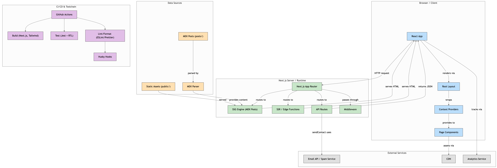

# Personal-Website

## Test runner

[](https://github.com/fabianwaller/personal-website/actions/workflows/test.yml)

## Setup

install dependencies

```bash
$ npm install
```

## Development

start dev server
```bash
$ npm run dev
```
run linter
```bash
$ npm run lint
```
run tests
```bash
$ npm run test
```

build icons
```bash
$ npm run icons
```

## Build

build for production
```bash
$ npm run build
```
start production server
```bash
$ npm run start
```

## Project structure

Generated by [GitDiagram](https://gitdiagram.com):


